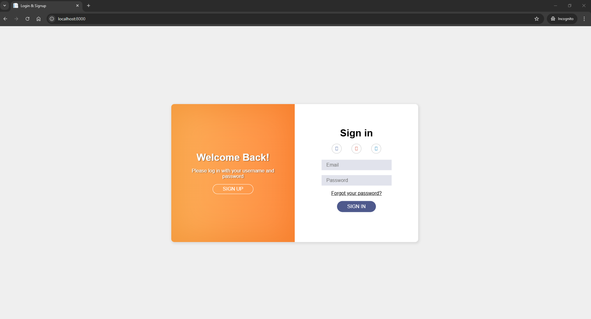
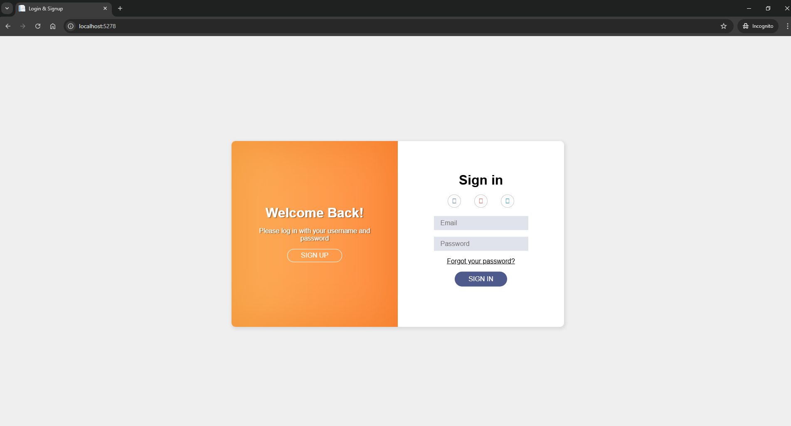
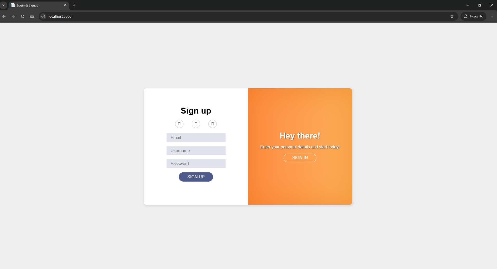

# Migrate from PHP to ASP.NET Project
PHP 7.0.0
ASP.NET Core 8.0

## Build and Run
### php Project
```bash
cd php-login/
```

using PHP built-in server to buid:
```bash
php -S localhost:8000
```

Test:
Access to: http://localhost:8000
(this link will show login1 page)

### ASP.NET Project
```bash
cd aspnet-login/
```
run project with:
```bash
dotnet run
```

Test:
Access to:
- For login1 page (this page is migrated from login1 page of php project):
http://localhost:5278
 
- For login2 page (there is a little difference with the login1 page above):
http://localhost:5278/login2

Output:
login1 page(php-project):


login1 page(asp.net-project):


login2 page (asp.net-project):


signup page(php-project):


signup page(asp.net-project):


signup2 page(asp.net-project):
